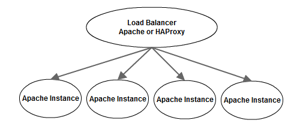

.. |reg| unicode:: U+00AE .. REGISTERED TRADEMARK
.. |tm| unicode:: U+2122 .. TRADEMARK

Django on Windows
=================

Michael Manfre

Presenter Notes
---------------

This talk will go over how I host a production Django site on windows, some the problems we faced, and decisions we made along the way.

Plenty of time for questions at the end.

----

Michael Manfre
==============

Developer at Semiconductor Research Corporation |reg|

	Pioneers in research collaboration |tm|

Maintainer of django-mssql 

	Django database backend for Microsoft SQL Server

Developer at Brewed By Us, LLC

    `http://brewedbyus.com`_ - Social home brewing web site to create and share recipes, 
    edit and evolve them, and keep a journal so you can keep a record of your brewing journey.

Manfre LLC

    IT consultant and custom software development with various languages and frameworks.

.. _`http://brewedbyus.com`: http://brewedbyus.com

----

Semiconductor Research Corporation |reg|
========================================

    "Semiconductor Research Corporation (SRC) is the world's leading technology research consortium. 
    With member companies and university research programs spanning the globe, SRC plays an 
    indispensable part in the R&D strategies of the industry's most influential entities. 
    SRC-sponsored university research is of the highest caliber and creates knowledge breakthroughs 
    that will invent the industries of tomorrow."
    
    -- `http://www.src.org/about/`_

.. _`http://www.src.org/about/`: http://www.src.org/about/

----

Web site purpose
================

.fx: web-site-purpose

  - Knowledge transfer
  
    - Publications
    - Reporting
    - Track research progress
    - Member feedback
  
  - Meetings & events
  - Student CV and recruitment

----

SRC's current web site
======================

----

Powered By
==========

  - Apache
  - CruiseControl.net
  - Django 1.4.2
  - HAProxy (Ubuntu)
  - Memcached
  - Mercurial (Hg)
  - Microsoft SQL Server 2008r2
  - nAnt
  - PowerShell
  - RedGate SQL schema and data compare
  - Windows

----

Why Windows?
============

  - Windows shop

    - IT knowledge

  - Legacy Business Database on MS SQL

    - Triggers, user funcs, stored procs, SSIS, SSRS
    - Replication not an option 
      (tech limitations and historical business reasons)

  - Didn't have a choice

----

Why Django?
===========

  - Previous iteration of site was VB6
  - ASP.NET workflow is a bit slower and heavier
  - Faster prototyping
  - Possibly more reasons, but decision made before I was hired

----

Why SQL Server?
===============

- Legacy business database
- Avoid extra database replication services

- SQL Server (master) <--> OpenVMS --> SQL Server (www)
  
  - SSIS jobs pump data from www to OpenVMS and master

Presenter Notes
---------------

Secondary factors against Django supported database. 
Oracle: Price;
Postgresql: Needed Cygwin;
MySQL: Feature limited;

----

SQL Server database backends
============================

django-pyodbc
-------------

  - Cross platform
  - Any ODBC connection
  - Missing datatypes and SQL Server specific features
  - Django 1.4 fork by Alex Vidal - `https://github.com/avidal/django-pyodbc`_ 

django-mssql
------------

  - Windows only
  - SQL server specific
  - Supports more datatypes and server features
  - Supports Django 1.2 - 1.5
  - `http://bitbucket.org/Manfre/django-mssql/`_

.. _`http://bitbucket.org/Manfre/django-mssql/`: http://bitbucket.org/Manfre/django-mssql/
.. _`https://github.com/avidal/django-pyodbc`: https://github.com/avidal/django-pyodbc

----

Future of Django-mssql
======================

  - Will maintain support for any Django version still supported with security patches
  - Support Python 3
  - 100% Pass Django test suite by Django 1.6
  
    - Currently 13 failures, 13 errors
  
  - Improve performance
  - MSSQL sugar
  
    - ``raw_callproc``
    
  - Continue to improve documentation
  
    - `http://django-mssql.readthedocs.org`_
    
.. _`http://django-mssql.readthedocs.org`: http://django-mssql.readthedocs.org  

Presenter Notes
---------------

----

HTTP server choices
===================

Three main questions
--------------------

  1. Can it run as a service without extra tools?
  2. Does it have any known issues that impact the project? (they all have issues)
  3. Is the windows build actively maintained and supported?

On Windows...
-------------

============  ===============  ============  ==================
Server        Runs as Service  Known Issues  Actively Supported
============  ===============  ============  ==================
Apache        Yes              No            Yes
IIS           Yes              No [1]        Yes
nginx         No               Yes [2]       Yes
Lighttpd      Yes              Yes [3]       No
============  ===============  ============  ==================

.. [1] Difficulty with automated build enviroment caused by changes between the various versions of
       IIS. Each OS and sometimes service pack provides a different IIS version.

.. [2] Orphans worker processes.

.. [3] Several documented issues in release notes at time of evaluation in 2009-2010. Windows
       build no longer actively maintained.

----

Apache on Windows
=================

- Actively maintained
- Lots of features
  
  - Can proxy if HAProxy or other option not available
  
- More resource heavy than other options
- MPM: mpm_winnt

  - One process, many threads
  
- mod_wsgi

  - Module adds WSGI support for Apache. Daemon mode not supported on Windows.
  - `http://code.google.com/p/modwsgi/`_

.. code::

    LoadModule wsgi_module "D:/web/modules/mod_wsgi-win32-ap22py26-3.3.so"
    
    <IfModule wsgi_module>
        WSGIScriptAlias / "D:/web/@SERVER_NAME@.wsgi"
        WSGIPassAuthorization On
    </IfModule>

.. _`http://code.google.com/p/modwsgi/`: http://code.google.com/p/modwsgi/

----

Useful Apache Modules
=====================

mod_rpaf

    Fixes client IP for Apache sitting behind one or more trusted proxies.

.. code::

    LoadModule log_rotate_module "D:/web/modules/mod_log_rotate.so"
    
    <IfModule rpaf_module>
        RPAFenable On
        RPAFsethostname On
        #             localhost lb1.src.org   lb2.src.org
        RPAFproxy_ips 127.0.0.1 192.168.1.10  10.10.10.10
        RPAFheader X-Forwarded-For
    </IfModule>

mod_xsendfile

    Serve files gated by Django.

.. code::

    LoadModule xsendfile_module "D:/web/modules/mod_xsendfile.so"
    
    <IfModule xsendfile_module>
        XSendFile on
        XSendFilePath "E:/"
        XSendFilePath "//file_server/unc/path"
        XSendFileIgnoreLastModified on
        XSendFileIgnoreEtag on
    </IfModule>

----

Understanding the GIL
=====================

- Most pages have lots of IO

  - Network (Request/Response)
  - Cache
  - Database
  - Disk (Templates)

- "Understanding the GIL" - David Beazley `http://www.dabeaz.com/GIL/`_

  - Threads release their lock when blocking for IO

.. _`http://www.dabeaz.com/GIL/`: http://www.dabeaz.com/GIL/

  Dear SRC, 
    Congratulations on launching your new site. Sorry it buckled under non-peak load.
  Sincerely,
    Global Interpreter Lock

----

Faking Process Based MPM
========================

Web farm on a box
-----------------
  
  - Load balancing Apache instance
  
    - HAProxy is a better option
  
  - `N`-worker instances
  - When worker crashes, site is still online
  - Configuration is ready to scale

  

----

Load balancing Apache instance
==============================

Basic balancer config
---------------------

.. code::

    <Proxy balancer://cluster>
    	BalancerMember http://192.168.1.100:9001 smax=3 max=10 ttl=120 route=www_1
    	BalancerMember http://192.168.1.100:9002 smax=3 max=10 ttl=120 route=www_2
    	BalancerMember http://192.168.1.100:9003 smax=3 max=10 ttl=120 route=www_3
    </Proxy>
    
    ProxyPass / balancer://cluster/ 
    ProxyPassReverse / balancer://cluster/

- Serves static files
- Responsible for web logs
- mod_proxy modules have been known to leak memory
- SSL endpoint
- Rewrite rules

----

Apache worker instances
=======================

- Configure to behave like a WSGI daemon

  - Apache balancer should handle everything not needed by Django project

- Disable logging

  .. code::
    
      LogFormat " " empty
      # Below will never output anything, but it will create an empty file
      CustomLog "D:/logs/carme/apache/access-1.log" empty env=NOTHING_IS_LOGGED

- If using HAProxy

  - Include rewrite rules
  - Add a stand alone instance for static content

----

Build and Deploy
================

.fx: build-deploy

  .. figure:: images/cctray.png
     :alt: CCTray with builds

- CruiseControl.net - `http://www.cruisecontrolnet.org/`_
- nAnt - `http://nant.sourceforge.net`_
- ``psexec`` for remote execution
- RedGate SQL Schema Compare

.. _`http://www.cruisecontrolnet.org/`: http://www.cruisecontrolnet.org/
.. _`http://nant.sourceforge.net`: http://nant.sourceforge.net

Presenter Notes
---------------

----

Virtualenv
==========

- Always create virtualenv with ``--system-site-packages`` due to `pywin32`

  - Many DLL python packages will not install properly in to a virtualenv.

.. code::

     virtualenv env --system-site-packages

- ``pywin32`` installer issues with some version.

  - Only install for one python version on a machine

----

Virtualenv Wrapper
==================

virtualenvwrapper-win

  Windows port of virtualenvwrapper.  
  `http://www.doughellmann.com/projects/virtualenvwrapper/`_

Install

.. code::
    
      pip install virtualenvwrapper virtualenvwrapper-win

Create virtualenv

.. code::
      
      mkvirtualenv myproject --system-site-packages

Switch virtualenv

.. code::

      C:\> workon myproject
      (myproject) C:\>

Leave virtualenv

.. code::

      (myproject) C:\> deactivate
      C:\> 

.. _`http://www.doughellmann.com/projects/virtualenvwrapper/`: http://www.doughellmann.com/projects/virtualenvwrapper/

----

Unit Tests
==========

Test actual schema or fake logic?

  - Computed Fields
  - Stored Procedures
  - Triggers
  - Views

Custom ``create_test_db`` management command

.. code::

    > python manage.py create_test_db
    Bouncing database test_db_name
    Dropping database test_db_name
    Creating database test_db_name
    Finding Files: <path pattern>
    Reading File: <file-1>
    Reading File: <file-n>
    ... repeats previous Finding and Reading many times ...
    Loading Seed Data

----

Django-mssql ``TEST_CREATE`` Setting
====================================

test_settings.py

.. code:: python

    DATABASES = {
        'default': {
            'NAME': 'test_db_name',
            'HOST': r'servername\ss2008',
            'TEST_NAME': 'test_db_name',
            'TEST_CREATE': False,
        }
    }

Run tests normally

.. code::
    
    > python manage.py test
    Creating test database for alias 'default'...
    Skipping Test DB creation
    ...
    
    OK
    Destroying test database for alias 'default'...
    Skipping Test DB destruction    

----

Questions And Feedback
======================

.fx: questions

.. figure:: images/manfre-crest.png
   :alt: Manfre's avatar
   :align: right

Michael Manfre

- Twitter: `@manfre`_
- BitBucket: `https://bitbucket.com/Manfre/`_
- Github: `https://github.com/manfre/`_
- Freenode: manfre

- Slides: `http://manfre.github.com/django-on-windows-talk/`_

.. _`@manfre`: http://twitter.com/manfre
.. _`https://bitbucket.com/Manfre/`: https://bitbucket.org/Manfre/
.. _`https://github.com/manfre/`: https://github.com/manfre/
.. _`http://manfre.github.com/django-on-windows-talk/`: http://manfre.github.com/django-on-windows-talk/
